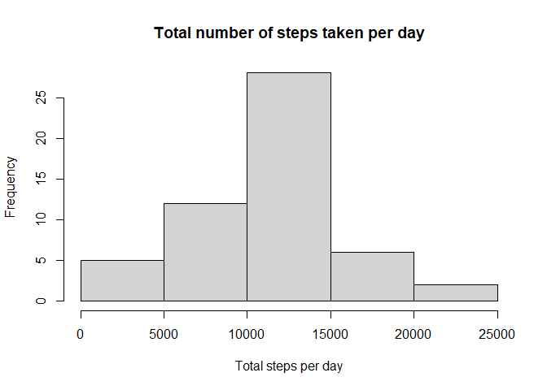
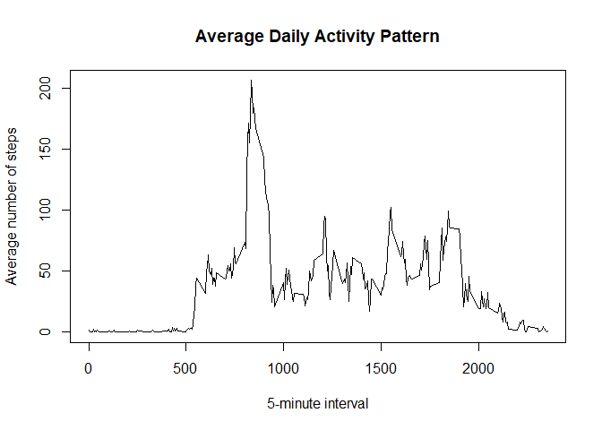
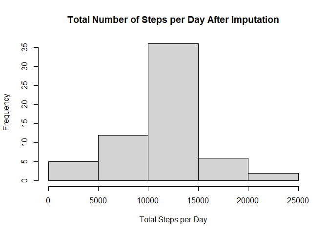
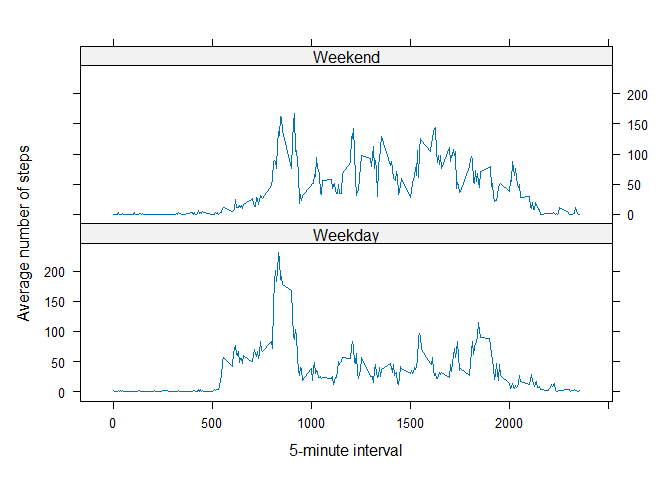

## Loading and preprocessing the data

``` r
activity <- read.csv("activity.csv")

activity$date <- as.Date(activity$date)
str(activity)
```

```
## 'data.frame':	17568 obs. of  3 variables:
##  $ steps   : int  NA NA NA NA NA NA NA NA NA NA ...
##  $ date    : Date, format: "2012-10-01" "2012-10-01" ...
##  $ interval: int  0 5 10 15 20 25 30 35 40 45 ...
```

``` r
summary(activity)
```

```
##      steps             date               interval     
##  Min.   :  0.00   Min.   :2012-10-01   Min.   :   0.0  
##  1st Qu.:  0.00   1st Qu.:2012-10-16   1st Qu.: 588.8  
##  Median :  0.00   Median :2012-10-31   Median :1177.5  
##  Mean   : 37.38   Mean   :2012-10-31   Mean   :1177.5  
##  3rd Qu.: 12.00   3rd Qu.:2012-11-15   3rd Qu.:1766.2  
##  Max.   :806.00   Max.   :2012-11-30   Max.   :2355.0  
##  NAs    :2304
```


## What is mean total number of steps taken per day?

``` r
total_steps <- aggregate(
  steps ~ date,
  data = activity,
  FUN = sum,
  na.rm = TRUE
)
head(total_steps)
```

```
##         date steps
## 1 2012-10-02   126
## 2 2012-10-03 11352
## 3 2012-10-04 12116
## 4 2012-10-05 13294
## 5 2012-10-06 15420
## 6 2012-10-07 11015
```

### Histogram


``` r
hist(
  total_steps$steps,
  main = "Total number of steps taken per day",
  xlab = "Total steps per day",
  ylab = "Frequency"
)
```

<!-- -->
### Mean and median total steps per day

``` r
  mean_total_steps <- mean(total_steps$steps)
  median_total_steps <- median(total_steps$steps)
  mean_total_steps
```

```
## [1] 10766.19
```

``` r
  median_total_steps
```

```
## [1] 10765
```
The mean total number of steps taken per day is 1.0766189\times 10^{4}, and the median is 10765

## What is the average daily activity pattern?
First, calculate the average number of steps taken for each 5-minute interval across all days.


``` r
interval_mean <- aggregate(
  steps ~ interval,
  data = activity,
  FUN = mean,
  na.rm = TRUE
)

head(interval_mean)
```

```
##   interval     steps
## 1        0 1.7169811
## 2        5 0.3396226
## 3       10 0.1320755
## 4       15 0.1509434
## 5       20 0.0754717
## 6       25 2.0943396
```

### Time series plot


``` r
plot(
  interval_mean$interval,
  interval_mean$steps,
  type = "l",
  xlab = "5-minute interval",
  ylab = "Average number of steps",
  main = "Average Daily Activity Pattern"
)
```

<!-- -->

### 5-minute interval with maximum average number of steps


``` r
max_interval <- interval_mean[
  which.max(interval_mean$steps),
]

max_interval
```

```
##     interval    steps
## 104      835 206.1698
```

The 5-minute interval with the maximum average number of steps is 835, with an average of 206.1698113 steps.


## Imputing missing values
### Total number of missing values


``` r
missing_values <- sum(is.na(activity$steps))

missing_values
```

```
## [1] 2304
```

The total number of missing values in the dataset is 2304.

### Strategy for imputing missing values

For each missing value, the mean number of steps for the corresponding 5-minute interval is used.


``` r
activity_imputed <- activity

activity_imputed$steps <- ifelse(
  is.na(activity_imputed$steps),
  interval_mean$steps[
    match(activity_imputed$interval, interval_mean$interval)
  ],
  activity_imputed$steps
)

sum(is.na(activity_imputed$steps))
```

```
## [1] 0
```
### Total steps per day after imputation


``` r
total_steps_imputed <- aggregate(
  steps ~ date,
  data = activity_imputed,
  FUN = sum
)

head(total_steps_imputed)
```

```
##         date    steps
## 1 2012-10-01 10766.19
## 2 2012-10-02   126.00
## 3 2012-10-03 11352.00
## 4 2012-10-04 12116.00
## 5 2012-10-05 13294.00
## 6 2012-10-06 15420.00
```
### Histogram after imputing missing values


``` r
hist(
  total_steps_imputed$steps,
  main = "Total Number of Steps per Day After Imputation",
  xlab = "Total Steps per Day",
  ylab = "Frequency"
)
```

<!-- -->
### Mean and median after imputation


``` r
mean_steps_imputed <- mean(total_steps_imputed$steps)
median_steps_imputed <- median(total_steps_imputed$steps)

mean_steps_imputed
```

```
## [1] 10766.19
```

``` r
median_steps_imputed
```

```
## [1] 10766.19
```

The mean total number of steps per day after imputation is 1.0766189\times 10^{4}, and the median is 1.0766189\times 10^{4}.


``` r
mean_difference <- mean_steps_imputed - mean_total_steps
median_difference <- median_steps_imputed - median_total_steps

mean_difference
```

```
## [1] 0
```

``` r
median_difference
```

```
## [1] 1.188679
```
After imputing the missing values, the mean and median estimates are compared with the original estimates. The imputation adds estimated activity for days that originally contained missing observations, which may affect the distribution of total daily steps.

## Are there differences in activity patterns between weekdays and weekends?
### Create weekday/weekend variable


``` r
day_number <- as.POSIXlt(activity_imputed$date)$wday

activity_imputed$day_type <- ifelse(
  day_number %in% c(0, 6),
  "Weekend",
  "Weekday"
)

activity_imputed$day_type <- factor(
  activity_imputed$day_type,
  levels = c("Weekday", "Weekend")
)

table(activity_imputed$day_type)
```

```
## 
## Weekday Weekend 
##   12960    4608
```
### Average activity pattern by type of day


``` r
day_type_mean <- aggregate(
  steps ~ interval + day_type,
  data = activity_imputed,
  FUN = mean
)

head(day_type_mean)
```

```
##   interval day_type      steps
## 1        0  Weekday 2.25115304
## 2        5  Weekday 0.44528302
## 3       10  Weekday 0.17316562
## 4       15  Weekday 0.19790356
## 5       20  Weekday 0.09895178
## 6       25  Weekday 1.59035639
```
### Weekday versus weekend activity pattern


``` r
library(lattice)

xyplot(
  steps ~ interval | day_type,
  data = day_type_mean,
  type = "l",
  layout = c(1, 2),
  xlab = "5-minute interval",
  ylab = "Average number of steps"
)
```

<!-- -->
The activity patterns show differences between weekdays and weekends. The panel plot allows us to compare how the average number of steps is distributed throughout the day for both types of days.
